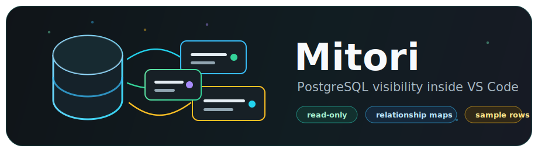

  

# Mitori

Mitori is a read-only PostgreSQL visualizer for VS Code.

It helps developers see schemas, tables, columns, keys, relationships, and sample rows without leaving the editor.

## Why Mitori exists

No-code tools make data visible.
Code-based tools give ownership.
Mitori tries to bring visibility into code-based development.

## Features

- Connects to PostgreSQL using DATABASE_URL
- Shows schemas
- Shows tables
- Shows columns
- Shows reconstructed SQL column definitions
- Marks primary keys
- Marks foreign keys
- Shows sample rows
- Works inside VS Code
- Read-only by default

## Requirements

- VS Code
- Node.js
- pnpm
- PostgreSQL database
- `.env` file with `DATABASE_URL`

## Usage

1. Open a PostgreSQL project in VS Code.
2. Add `DATABASE_URL` to `.env`.
3. Open the Mitori sidebar.
4. Connect to the database.
5. Inspect tables and preview rows.

## Running locally

1. Open this extension folder in VS Code.
2. Run `pnpm install`.
3. Press `F5` and choose `Run Mitori Extension`.
4. In the Extension Development Host window, open the PostgreSQL project you want to inspect.
5. Open the Mitori icon from the Activity Bar.

Opening a normal new VS Code window does not load the development extension. It must be opened through the Extension Development Host, or with `code --extensionDevelopmentPath=/path/to/mitori /path/to/your/project`.

## What Mitori does not do yet

- migrations
- seeds
- editing rows
- editing schema
- production deployment
- arbitrary SQL console

## Roadmap

### v0

Read-only PostgreSQL visualization.

### v0.1

Better error states, row counts, search/filter in previews.

### v0.2

Relationship diagram.

### v0.3

Local row editing.

### v0.4

Migration awareness.

### v1

Bubble-like database cockpit inside VS Code.
